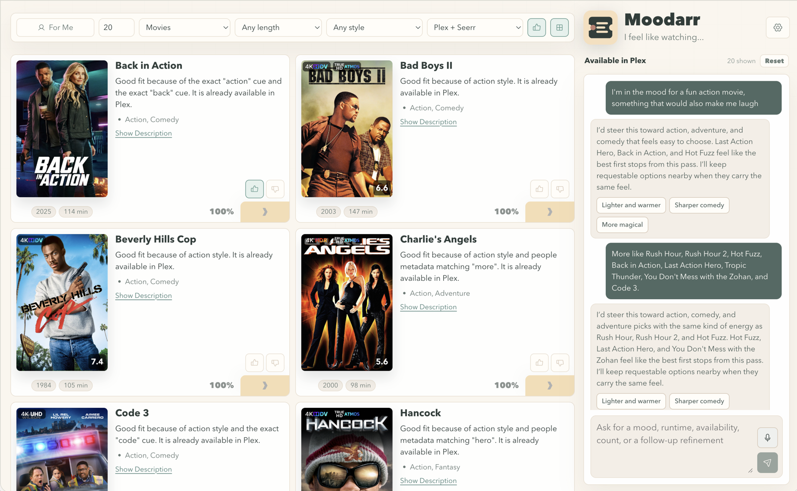
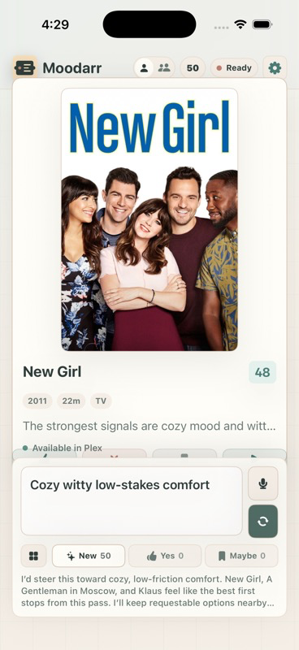
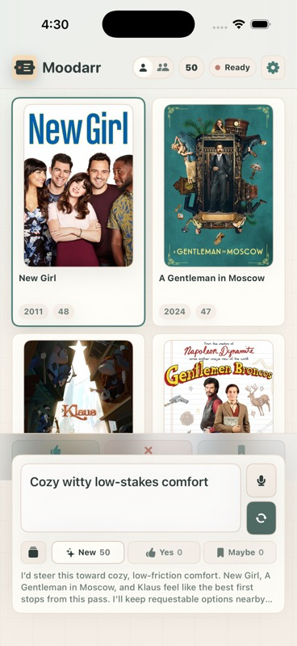

<h1 align="center">Moodarr</h1>

<p align="center">
  <strong>A local-first Plex + Seerr companion for finding what to watch.</strong>
  <br/>
  Moodarr reads your Plex library and Seerr/Jellyseerr request state, ranks natural-language matches, and only creates requests after explicit confirmation.
  <br/>
  <br/>
  MoodRank turns fuzzy mood and feel language into an indexed recommendation layer for the arr stack: hybrid retrieval, deterministic scoring, feedback learning, and optional constrained AI reranking over your real Plex and Seerr catalog.
</p>

<p align="center">
  <a href="https://github.com/jremick/moodarr/actions/workflows/ci.yml"></a>
  <a href="LICENSE"></a>
  
  <a href="docs/"></a>
  
</p>
<p align="center">
  
</p>

<p align="center">
  
  
</p>

> **Public alpha:** Moodarr is early software for inspection and trial use. APIs, configuration, packaging, recommendation behavior, and admin flows may change before beta.

## What Moodarr Does

- React + Vite client.
- Fastify TypeScript API.
- Local SQLite cache.
- Persistent server-side config for container installs.
- Admin screen for connection settings, sync controls, and runtime status.
- Optional Plex sign-in for non-admin Finder access and local user visibility.
- Fixture mode for contributors without Plex or Seerr.
- Plex read APIs only.
- Seerr/Jellyseerr read APIs plus explicit confirmed request creation.
- Optional server-side OpenAI brief parsing, embeddings, reranking, explanations, and refinement options when `OPENAI_API_KEY` exists.

## Current Status

Moodarr is in public alpha. The core fixture-mode, Plex/Seerr sync, natural-language discovery, admin settings, request preview, request creation, Docker, and Unraid packaging paths exist.

Known limitations:

- Setup and configuration are still changing.
- The project is designed for LAN/VPN or trusted container-network deployment, not direct public internet exposure.
- Plex app deep links use Plex metadata keys and may still need compatibility checks across Plex clients.
- There is no GitHub release object yet; immutable alpha tags and GHCR images are available.

## Quick Start

Prerequisites: Node.js 24 or newer.

```bash
node --version # requires Node 24+
npm install
cp .env.example .env
npm run dev
```

Open the Vite URL printed by the dev server. Fixture mode is enabled by default, so the app works without private media servers.

## Container Quick Start

```bash
docker pull ghcr.io/jremick/moodarr:v0.1.0-alpha.11
docker run --rm -p 4401:4401 \
  -v moodarr-data:/data \
  -e MOODARR_ADMIN_TOKEN="replace-with-a-long-random-token" \
  -e MOODARR_ADMIN_AUTO_SESSION=true \
  ghcr.io/jremick/moodarr:v0.1.0-alpha.11
```

Open `http://127.0.0.1:4401`, then configure Plex and Seerr. The bundled Web UI receives an HTTP-only admin session from the container-side admin token. See [docs/UNRAID.md](docs/UNRAID.md) for Unraid notes and the template in [unraid/moodarr.xml](unraid/moodarr.xml).

Moodarr is intended to run as a container where it can reach your Plex and Seerr/Jellyseerr services. For most home media setups, that means running it on the same LAN, VPN, or trusted container network rather than exposing media-server APIs to a public host.

## Configuration

Set these values in `.env` for real integrations:

- `MOODARR_ADMIN_TOKEN`
- `PLEX_BASE_URL`
- `PLEX_TOKEN`
- `SEERR_BASE_URL`
- `SEERR_API_KEY`
- `MOODARR_PLEX_AUTH_ENABLED=true` to let Plex users access Finder routes without the admin token.
- `MOODARR_PLEX_AUTH_ALLOW_NEW_USERS=true` to create local users on first Plex sign-in when the account has access to the configured server.
- `AI_PROVIDER=openai`
- `OPENAI_API_KEY`
- `OPENAI_MODEL` defaults to `gpt-5.5`
- `OPENAI_EMBEDDING_MODEL` defaults to `text-embedding-3-large`
- `OPENAI_REASONING_EFFORT` defaults to `low` for `gpt-5.5`

Tokens are read by the backend only. They are not returned by API routes, embedded in the client bundle, placed in poster URLs, or logged without redaction.

Optional Plex Watchlist actions store the signed-in user's Plex access token server-side so Moodarr can call Plex Discover on that user's behalf. That token stays in the private SQLite database and is not returned to clients.

Container installs can also save integration settings through the Admin screen. They are written to `MOODARR_CONFIG_PATH`, which defaults to `/data/config.json` in the Docker image. Environment variables still take precedence on restart.

When admin auth is enabled, private catalog reads, search, poster proxying, request previews, and request creation require either the admin token/session or a Plex user session when Plex sign-in is enabled. Admin writes, diagnostics, sync controls, and user management still require the admin token/session. Keep Moodarr LAN/VPN-only unless another authentication layer protects it.

Native clients can request a user-session token during Plex auth completion by sending `nativeSession: true` to `POST /api/auth/plex/complete`. The response includes a non-admin `sessionToken` and `sessionExpiresAt`; native clients should store that token in the platform secure store and send it as `Authorization: Bearer <sessionToken>` for Finder routes. That token does not grant admin access.

Search responses include `sessionId` when recommendation-run logging succeeds. Native clients should include that id on `POST /api/feel-feedback` so swipes and pairwise choices attach to the displayed slate. Mobile retry queues should also send a unique `clientEventId`; duplicate retries return the original feedback event instead of applying learning twice.

## API

- `GET /api/health`
- `GET /api/config/status`
- `GET /api/auth/session`
- `POST /api/auth/plex/start`
- `POST /api/auth/plex/complete`
- `POST /api/auth/logout`
- `POST /api/plex/test`
- `POST /api/plex/watchlist`
- `POST /api/seerr/test`
- `POST /api/library/sync`
- `POST /api/seerr/sync`
- `GET /api/library/stats`
- `POST /api/search`
- `GET /api/items/:id`
- `GET /api/items/:id/poster`
- `POST /api/requests/preview`
- `POST /api/requests/create`
- `GET /api/admin/settings`
- `PUT /api/admin/settings`
- `GET /api/admin/users`
- `PATCH /api/admin/users/:id`
- `GET /api/admin/sync/status`
- `POST /api/admin/sync/run`
- `GET /api/admin/recommendations/diagnostics`
- `GET /api/admin/feel-profiles`
- `GET /api/admin/feel-profiles/export`
- `DELETE /api/admin/feel-profiles`
- `POST /api/admin/feel-profiles/rollback`
- `GET /api/admin/support-bundle`

## Verification

```bash
npm run verify
```

The verification suite runs linting, typechecking, API tests, a production client build, and a secret scan against generated client assets.

For release packaging work, run:

```bash
npm run verify:release
```

That adds recommendation evals, Compose/Unraid packaging checks, and a Docker smoke test.

Mood/Feel algorithm work also has focused evals:

```bash
npm run eval:recommendations
npm run eval:profile-replay
npm run eval:profile-journeys
```

Optional local-only external seed validation, when you have an ignored MovieLens dataset directory:

```bash
npm run validate:movielens-tag-genome -- --dir /path/to/ml-25m --threshold 0.7
```

## Documentation

- [Release readiness](docs/RELEASE.md) - local and CI gates for alpha packaging.
- [Unraid deployment](docs/UNRAID.md) - container defaults and Unraid template notes.
- [Production plan](docs/PRODUCTION_PLAN.md) - current baseline and hardening backlog.
- [Recommendation engine](docs/RECOMMENDATION_ENGINE.md) - ranking and retrieval behavior.
- [MoodRank current algorithms](docs/MOODRANK_CURRENT_ALGORITHMS.md) - living map of stages, feedback, and eval metrics.
- [Mood/Feel profile goal](docs/MOOD_FEEL_PROFILE_RESEARCH_GOAL.md) - public research-backed product direction.
- [Mood/Feel robustness V2](docs/MOOD_FEEL_ROBUSTNESS_V2_GOAL.md) - synthetic journey, drift, rollback, and external seed hardening.
- [Mood/Feel controlled usage](docs/MOOD_FEEL_CONTROLLED_USAGE_GOAL.md) - first real-signal readiness loop before mobile collection.
- [Mood feature index](docs/MOOD_FEATURE_INDEX.md) - local mood taxonomy and feature mapping.
- [Seerr auth alignment](docs/research/2026-06-18-seerr-auth-alignment.md) - Plex user-management alignment notes.

## Community and Support

- [Issues](https://github.com/jremick/moodarr/issues) - bugs and concrete feature requests.
- [Contributing](CONTRIBUTING.md) - local development, verification, and safety expectations.
- [Security policy](SECURITY.md) - private vulnerability reporting and deployment boundaries.

## Request Safety

`POST /api/requests/preview` returns the exact media type, TMDB media ID, title, and TV seasons that would be requested. `POST /api/requests/create` requires both `confirmed: true` and the preview confirmation phrase. Search and AI output cannot create a request directly.

## Fixture Mode

Fixture mode seeds a small mixed Plex and Seerr catalog with available, requestable, already requested, and partially available examples. It is intended for local development and CI without private server access.

## License

Moodarr is licensed under the [Apache License 2.0](LICENSE).
